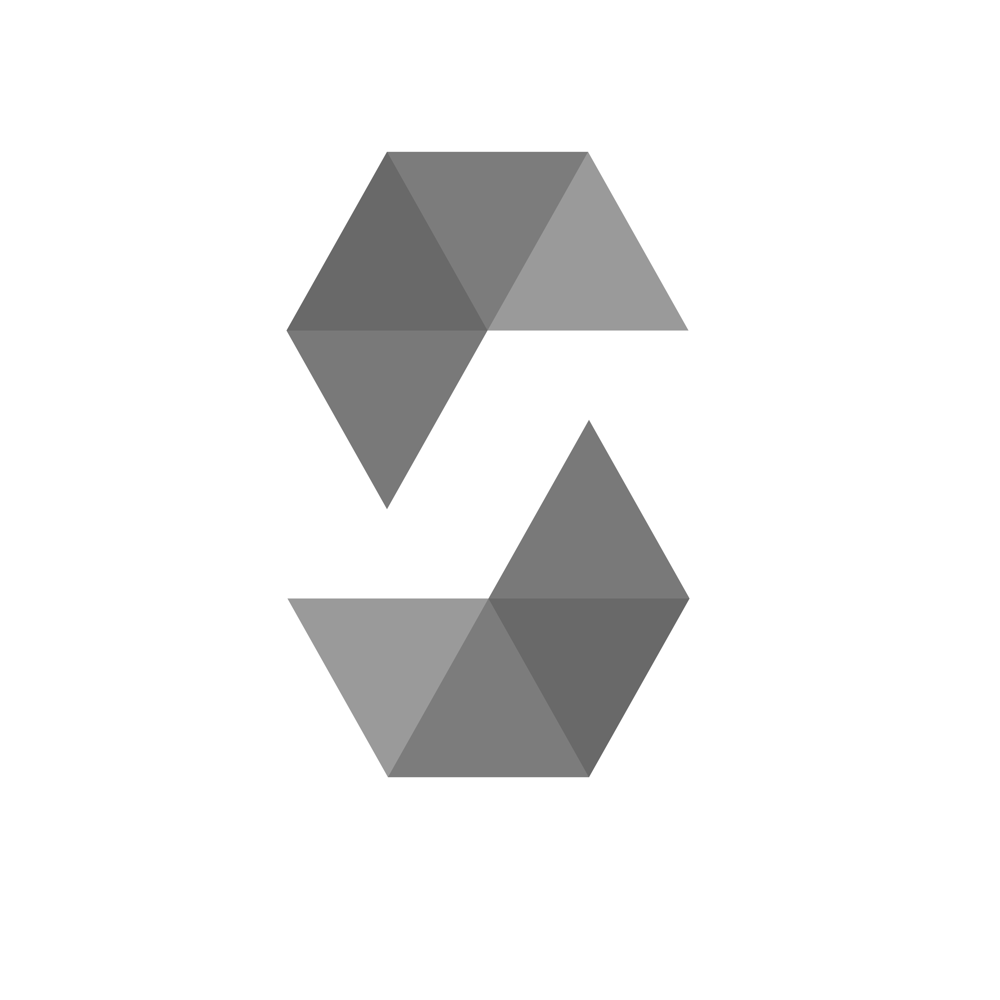

## Hey there! I'm Bella 👋

 

I like to write code, and I enjoy ***mingling*** in languages. Sometimes, I reverse engineer stuff.

 
 

<!--- thanks to @fuwn for showing me that this feature is a thing :o  <3 --->

languages

  

<em>and more...</em>

github language stats

github activity stats

 
 

<!--- in -->

<!--- soundcloud -->

<!--- htb -->

<!--- ether docs-->

<!--- website -->

<!--- twitter -->

